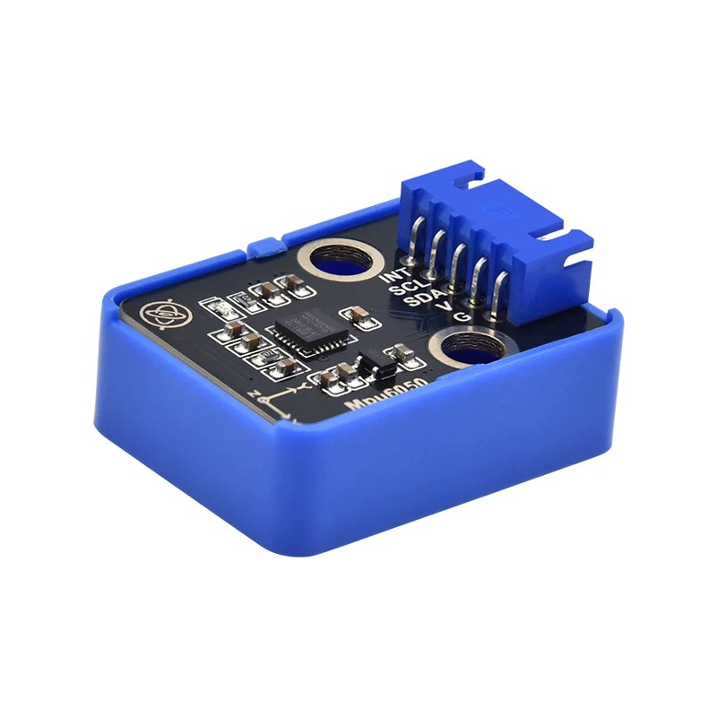

# ACCELERATION SENSOR -- MPU6050

!!! info "MPU6050"
    The MPU6050 is in fact an inertial measurement unit (IMU) that integrates a 3-axis gyroscope and a 3-axis accelerometer. It is widely used in various applications such as robotics, drones, and motion tracking. Here, we only use the accelerometer part of the MPU6050 to measure acceleration in three axes (X, Y, Z).

{width=70%}

## SPECIFICATIONS

| **Feature** | **Specification** |
|-------------|-------------------|
| **Operating Voltage** | 3.3V to 5V |
| **Communication Interface** | I2C |
| **Measurement Range** | ±2g, ±4g, ±8g, ±16g (configurable) |
| **Resolution** | 16 bits |
| **Sensitivity** | 16384 LSB/g (for ±2g range) |

## WIRING
The wiring of the MPU6050 is straightforward. It typically uses the I2C protocol for communication, which requires only two wires (SDA and SCL) in addition to power and ground connections.

| MCU Pin | MPU6050 Pin |
|----------|-------------|
| VCC      | VCC         |
| GND      | GND         |
| SDA      | SDA         |
| SCL      | SCL         |
| --       | INT         |

!!! tip "Note"
    The INT pin is optional and can be used for interrupt-driven applications. For basic applications, you can leave it unconnected. In this project, we will not use the INT pin.