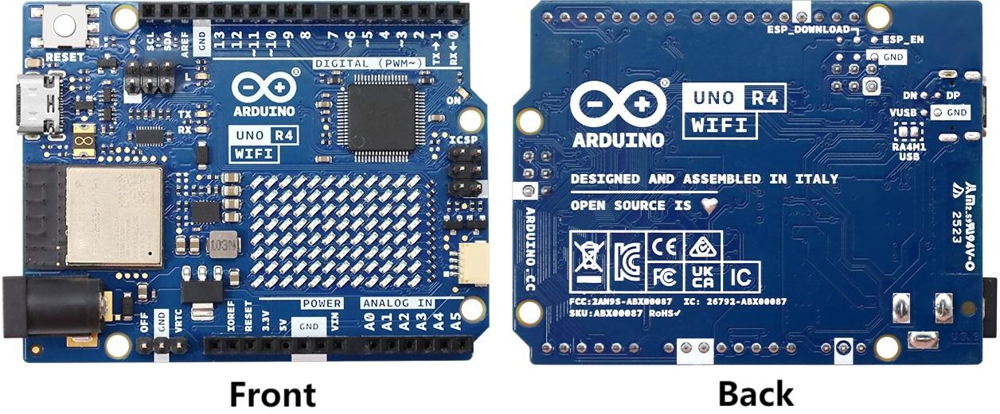

# MAIN CONTROLLER BOARD

!!! info "Main Controller Board"
    In this project， the main controller board serves two purposes: central control and Wi-Fi communication.

## Main Controller Board Appearance

## Main Controller Board Pin Layout

## Reference Links

-   :simple-arduino:{ .lg .middle } __ARDUINO UNO R4 WIFI__

    ---

    [:octicons-arrow-right-24: <a href="https://docs.arduino.cc/hardware/uno-r4-wifi/#features" target="_blank"> LINK </a>](#)

