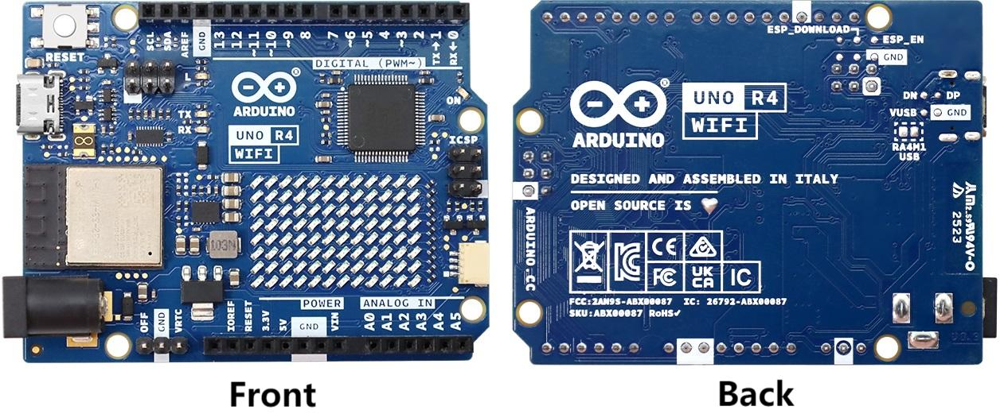
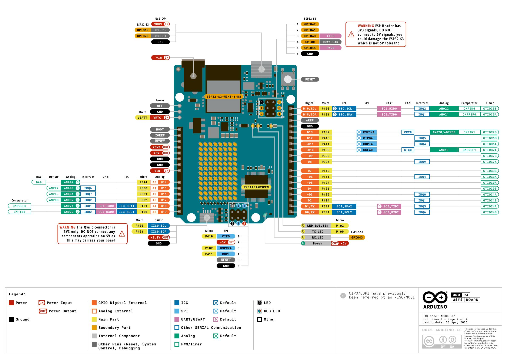

# 主控板

!!! info "主控板"
    在本项目中，主控板起到两方面作用：一是核心控制，而是wifi通信。

## 主控板外观

## 主控板针脚排布

## 参考链接

-   :simple-arduino:{ .lg .middle } __ARDUINO UNO R4 WIFI__

    ---

    [:octicons-arrow-right-24: <a href="https://docs.arduino.cc/hardware/uno-r4-wifi/#features" target="_blank"> 链接 </a>](#)

