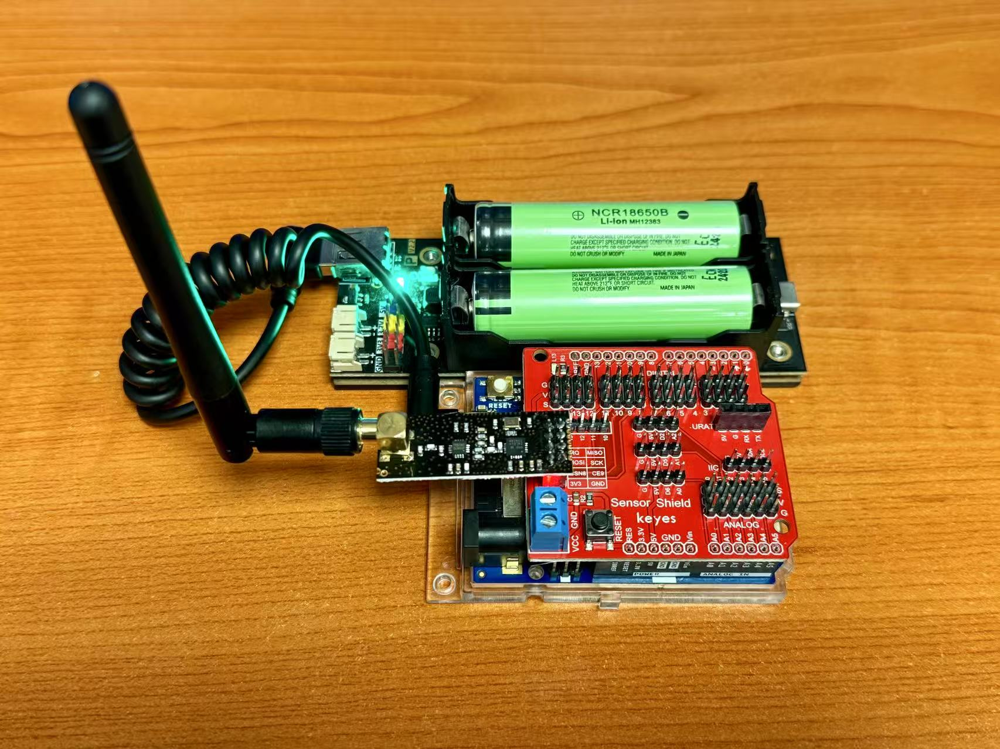

# 电源供应

!!! note "电源供应"
    电源供应确保设备能够稳定运行。Arduino Node可以通过多种方式供电，包括USB、外部电源适配器和电池。选择合适的电源供应方式可以提高设备的可靠性和性能。这里主要介绍电池供电方式以适应户外环境。

## 电池

如图所示，本项目采用两节18650锂电池进行供电。18650锂电池是一种常用的可充电电池，具有较高的能量密度和较长的使用寿命。它们通常用于便携式电子设备和电动工具等。

## 电池盒

为了方便安装和更换电池，本项目使用了一个18650电池盒。电池盒可以容纳两节18650锂电池，并提供必要的连接接口。它通常配有开关和指示灯，以便用户可以轻松地控制电源和查看电池状态。