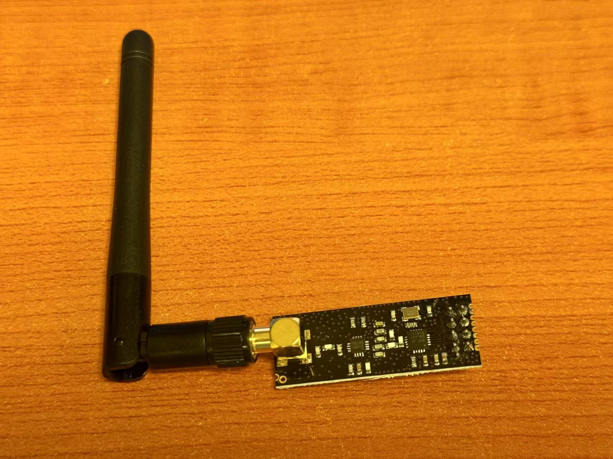

# RADIO FREQUENCY



Radio frequency (RF) module nRF24L01 is a low-power, low-cost 2.4GHz wireless transceiver suitable for short-range wireless communication. It supports multiple data rates and multi-channel operation, has strong anti-interference capabilities, and offers a longer transmission distance. Compared to Wifi, radio frequency features low latency, low power consumption, and is more suitable for applications requiring real-time data transmission.

## Parameters

nRF24L01 Technical Specifications

| Parameter       | Description                                  |
|------------------|----------------------------------------------|
| Frequency        | 2.4 GHz ISM band                             |
| Data Rate        | 250 kbps / 1 Mbps / 2 Mbps                   |
| Operating Voltage| 1.9V – 3.6V (Recommended: 3.3V)              |
| Range            | Approx. 10–100 meters (depends on antenna)  |
| Interface        | SPI protocol                                 |
| RX Current       | Approx. 12.3 mA                              |
| TX Current       | Approx. 11.3 mA (0 dBm output)               |
| Packet Size      | 1 to 32 bytes                                |
| Address Width    | 3 to 5 bytes                                 |
| Features         | Auto-ACK, Auto-Retransmit, Multichannel RX   |

## Wiring


| Pin | Name | Description                               |
|-----|------|-------------------------------------------|
| 1   | GND  | Ground                                    |
| 2   | VCC  | Power supply (Recommended 3.3V, no 5V!)   |
| 3   | CE   | Chip Enable (mode control: TX/RX switch) |
| 4   | CSN  | SPI Chip Select (active low)             |
| 5   | SCK  | SPI Clock Input                          |
| 6   | MOSI | Master Out Slave In                      |
| 7   | MISO | Master In Slave Out                      |
| 8   | IRQ  | Interrupt Pin (optional)                 |
```
