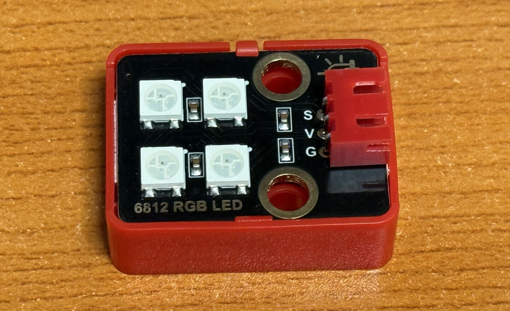

# RGB LED

!!! info "RGB LED"
    RGB LED is a type of LED that can display multiple colors. It typically consists of three independent LEDs that emit red, green, and blue light. By adjusting the brightness of these three colors, various colors can be mixed.

## Wiring

| Arduino Pin | 6812 RGB LED Pin |
|-------------|------------------|
| V           | V                |
| G           | G                |
| S （D7）    | S                |