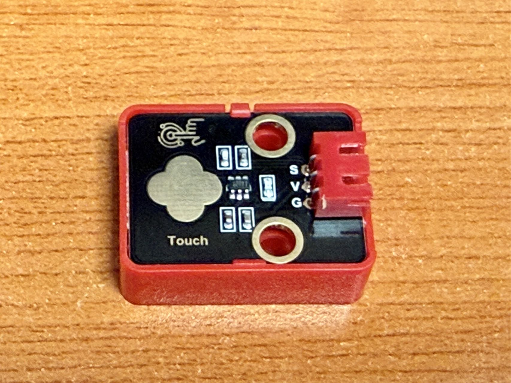

# 触摸传感器

!!! info "触摸传感器"
    触摸传感器是一种能够检测物体接触的传感器。它通常用于各种电子设备中，以实现用户交互功能。

## 连接方式

| Arduino 引脚 | 6812 RGB LED 引脚 |
|-------------|------------------|
| V           | V                |
| G           | G                |
| S （D3）    | S                |