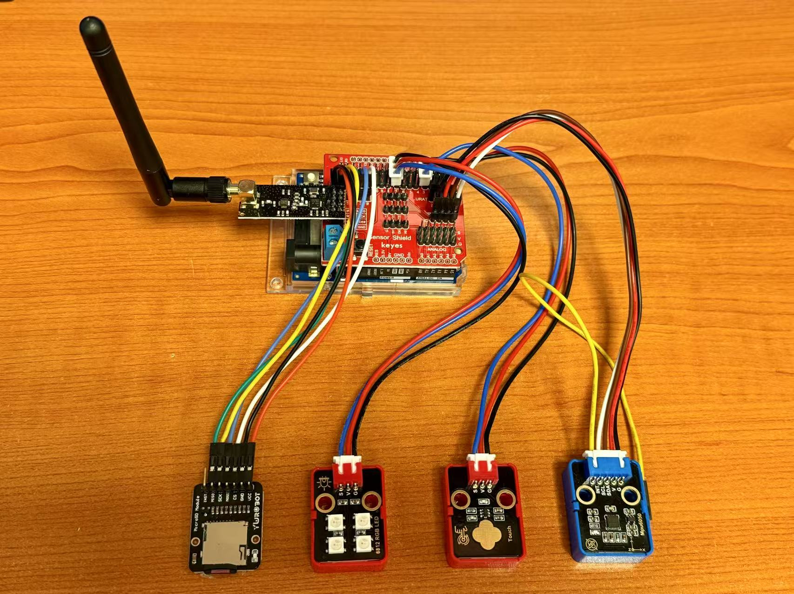

# HARDWARE

Item List:

| Component | Description |
| --------- | ----------- |
| Arduino UNO R4 WiFi | Main controller for the node, providing processing power and connectivity. |
| Sensor Shield | A shield that connects to the Arduino for easy sensor integration. |
| MPU6050 | An acceleration sensor that measures motion and orientation. |
| SD Module & Card | Used for data storage, allowing the node to log sensor data. |
| RGB LED | Provides visual feedback, indicating the status of the node. |
| Touch Sensor | Allows user interaction, enabling control of the node. |
| NRF24L01 Module & Antenna | Enables local wireless communication between nodes. |
| BMS & Battery | Provides power to the entire node, making it portable. |

!!! note

    These components together form a fully functional IoT wireless sensor node capable of collecting data, storing information, and communicating wirelessly. Each component plays a crucial role in ensuring the efficient operation and reliability of the node.