# 硬件组装

!!! tip "提示"
    如果没有外壳，可以跳过相关步骤，直接使用杜邦线连接各个组件。

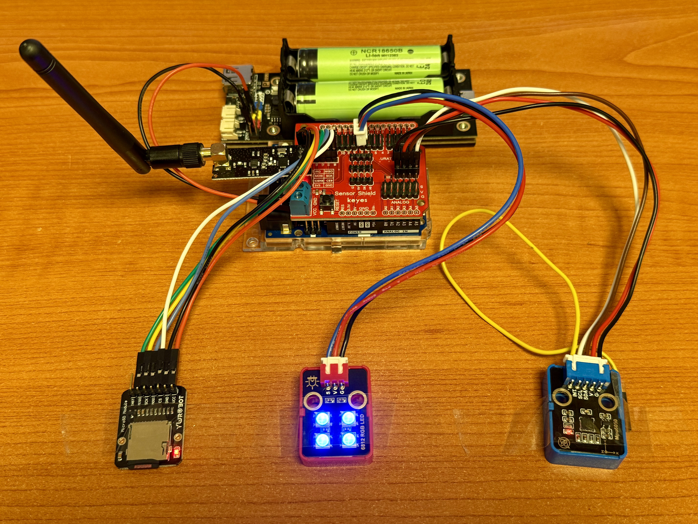

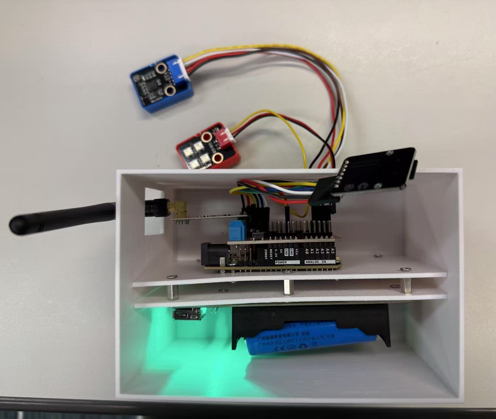

## 物品清单

| 组件 | 描述 |
| --------- | ----------- |
| Arduino UNO R4 WiFi | 节点的主控制器，提供处理能力和连接性。 |
| Sensor Shield | 连接到Arduino的扩展板，便于传感器集成。 |
| MPU6050 | 一个加速度传感器，用于测量运动和方向。 |
| SD模块和卡 | 用于数据存储，使节点能够记录传感器数据。 |
| RGB LED | 提供视觉反馈，指示节点的状态。 |
| NRF24L01模块和天线 | 使节点之间能够进行本地无线通信。 |
| BMS和电池 | 为整个节点提供电源，使其便携。 |
| 外壳 | 保护内部电子元件，并提供美观的外观。 |

## 1 电池盒安装

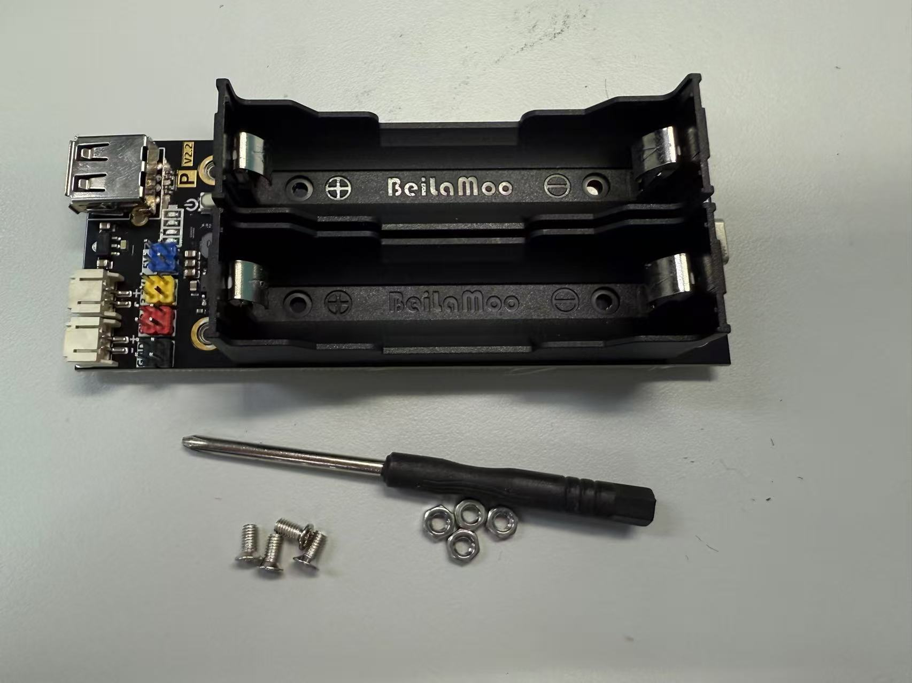

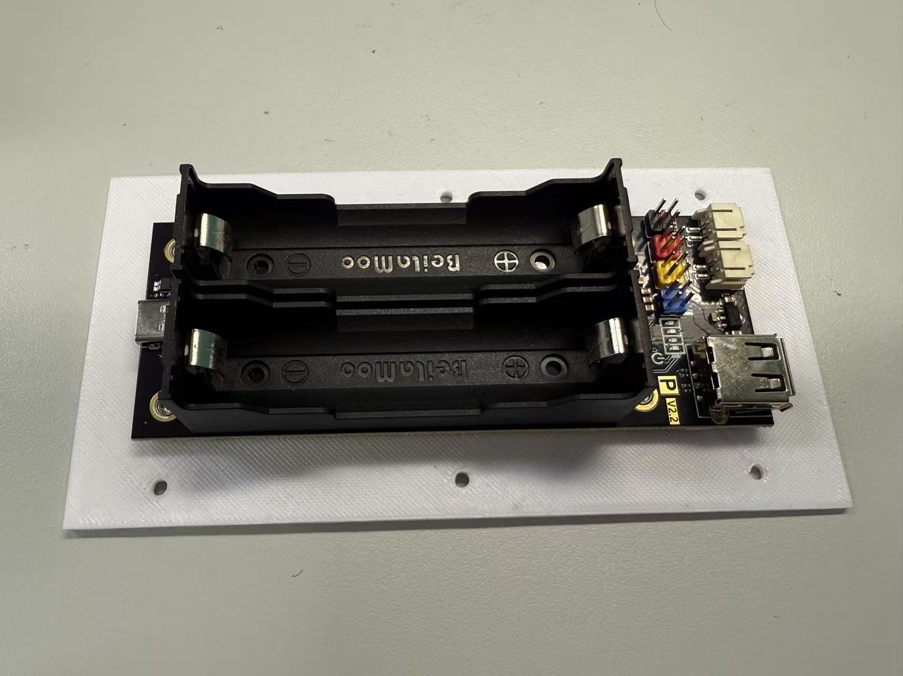

如图所示，讲电池盒从包装袋中拿出来，使用螺丝刀，螺丝和螺栓将其固定在安装板上。

!!! warning "注意"
    确保电池盒的安装位置和方向正确，可以参考图片中的示例，从而保证后续组件的顺利安装。

## 2 主控制板安装

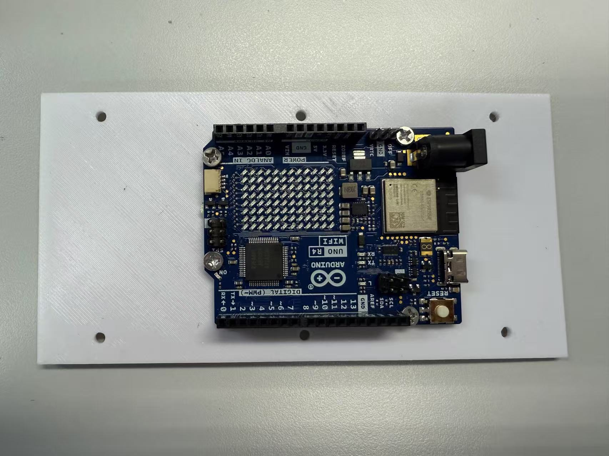

将主控制板（Arduino UNO R4 WiFi）使用螺丝和螺栓安装到相应的安装板上。确保板子牢固地固定好。

!!! warning "注意"
    确保主控制板的安装位置正确，并且所有连接器和接口都朝向易于访问的方向，以便后续连接其他组件。可以参考图片中的示例进行安装。

## 3 传感器扩展板组装

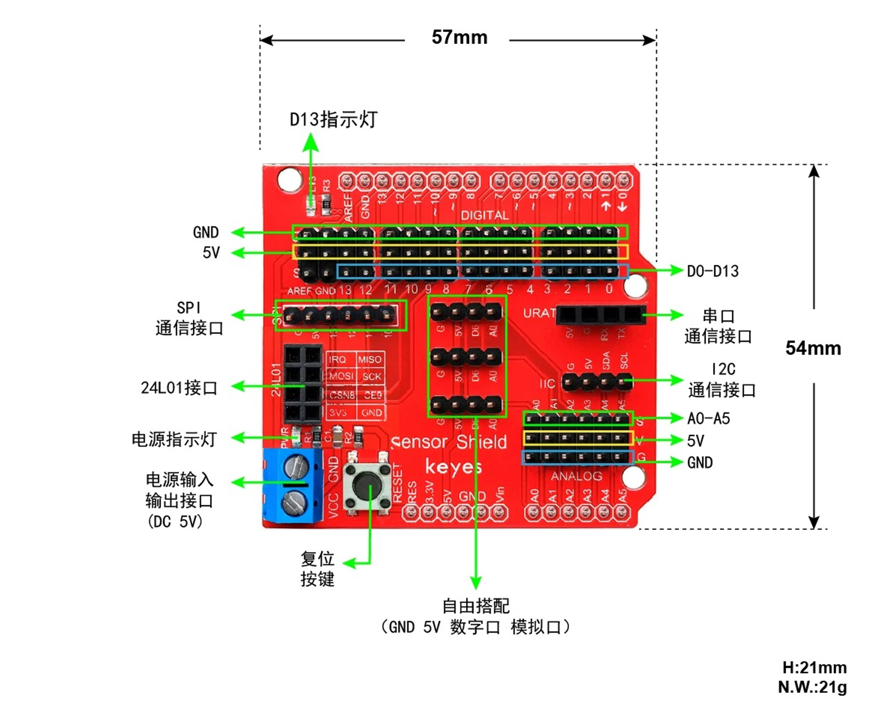

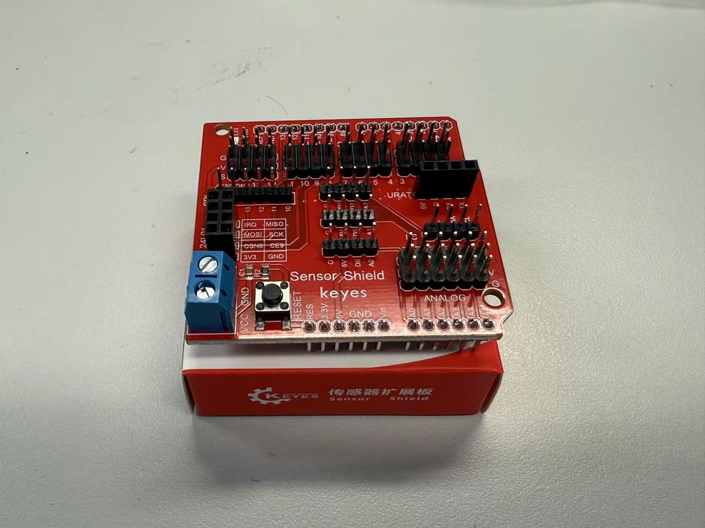

将传感器扩展板（Sensor Shield）安装到主控制板上。确保所有引脚正确对齐并牢固连接。

!!! warning "注意"
    确保传感器扩展板牢固地附着在主控制板上，并且确保引脚对齐，可以参考引脚附近的标记。所有连接都要牢固，以防在操作过程中发生断开。

## 4 MPU6050安装

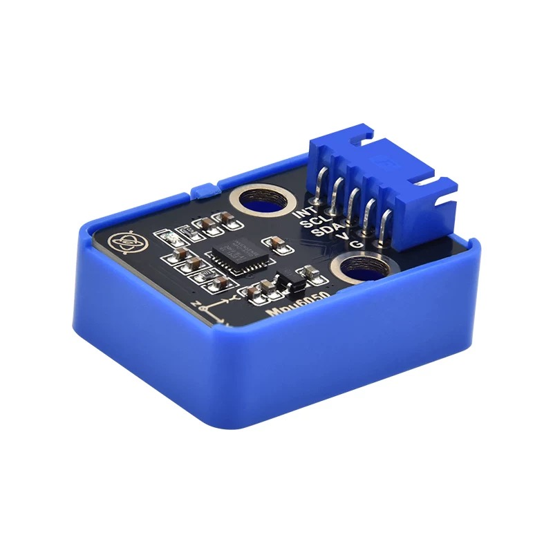

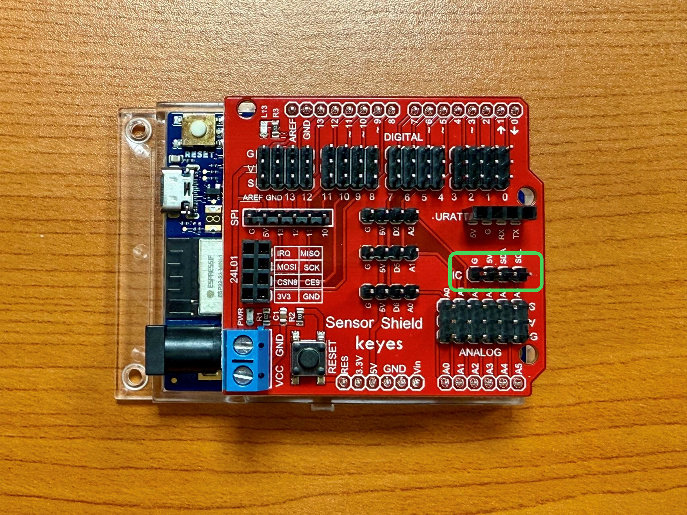

| MCU Pin | MPU6050 Pin |
|----------|-------------|
| VCC      | VCC         |
| GND      | GND         |
| SDA      | SDA         |
| SCL      | SCL         |
| --       | INT         |

如图所示，MPU6050传感器需要通过IIC接口连接到主控制板。使用MPU6050配套的四接口接线，将MPU6050的VCC引脚连接到Arduino的VCC引脚，GND引脚连接到GND引脚，SDA引脚连接到SDA引脚，SCL引脚连接到SCL引脚。INT引脚可以不连接。

## 5 RF24L01模块安装

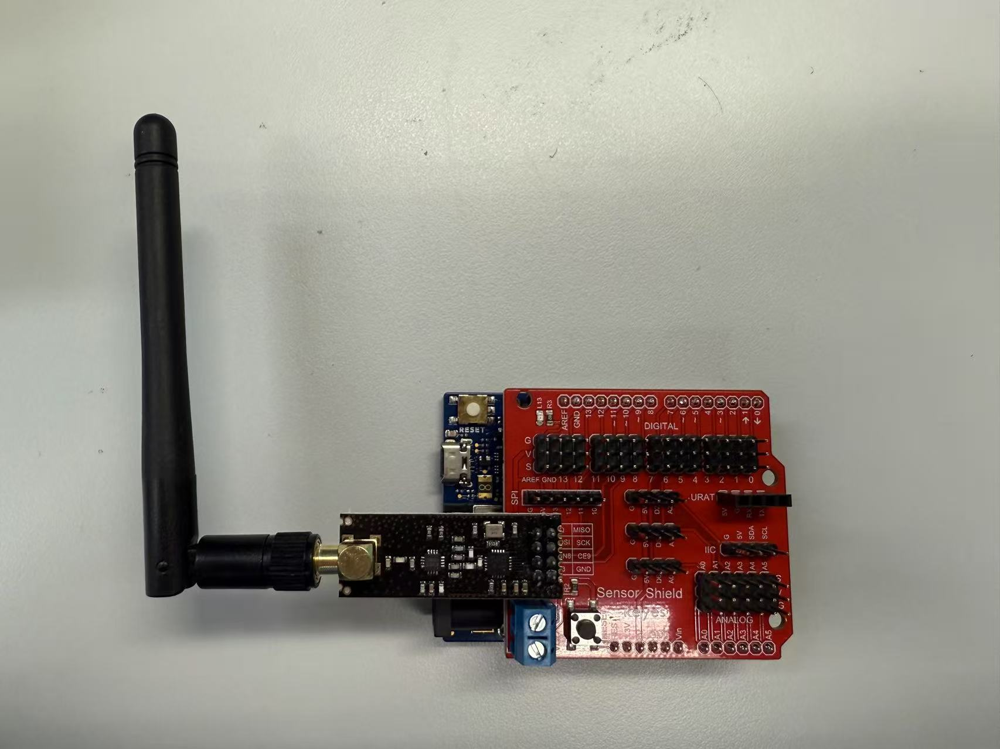

如图所示，将RF模块拼装好后直接插到传感器扩展板上。确保RF模块的引脚正确对齐并牢固连接。

## 6 RGB LED安装

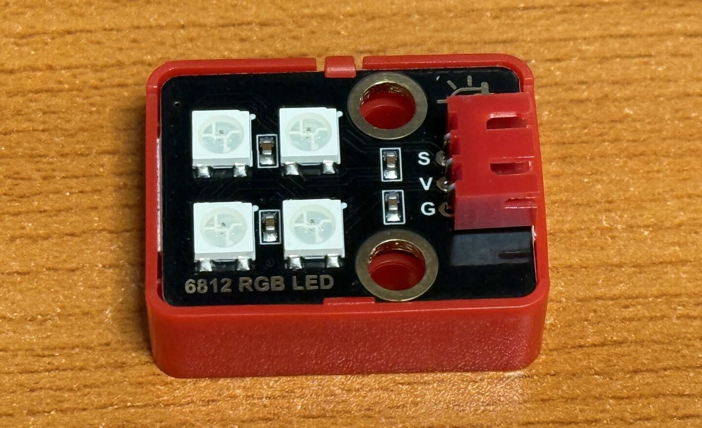

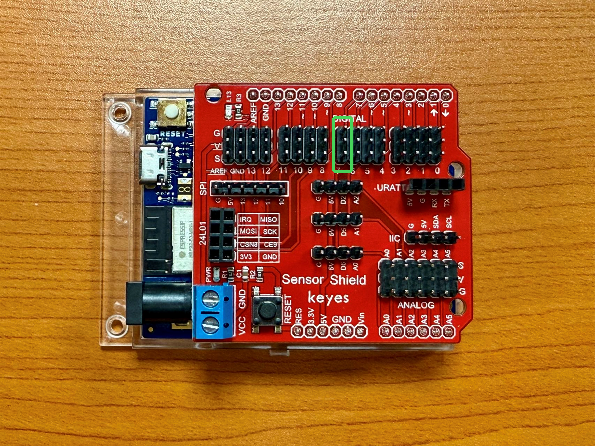

| Arduino Pin | 6812 RGB LED Pin |
|-------------|------------------|
| V           | V                |
| G           | G                |
| S （D7）    | S                |

将RGB LED连接到传感器扩展板上。使用RGBLED配套的三根杜邦线，将RGB LED的引脚连接到传感器扩展板的相应引脚上。

!!! warning "注意"
    确保RGB LED的连接正确，V引脚连接到V，G引脚连接到G，S引脚连接到D7。确保所有连接牢固，以防止在操作过程中发生断开。

## 7 SD模块安装

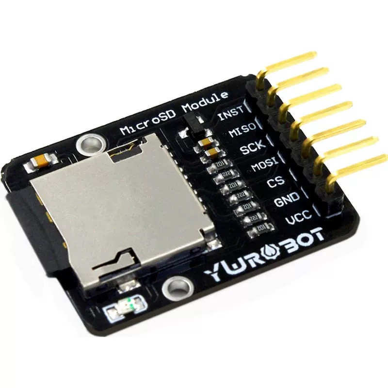

| Arduino Pin | SD Card Module Pin |
|-------------|--------------------|
| 5V          | VCC                |
| GND         | GND                |
| D10         | CS                 |
| D11         | MOSI               |
| D12         | MISO               |
| D13         | SCK                |

如图所示，SD卡模块需要通过SPI接口连接到主控制板。

!!! warning "注意"
    确保SD卡模块的连接正确且牢固，如果杜邦线连接不牢固，请更换或者联系技术支持。

## 8 外壳组装

!!! warning "注意"
    这一步需要在程序烧录完成后进行，以确保所有组件都能正确放置。

- 使用隔离柱和螺栓将电池盒和主控板所在的挂载板固定在一起。

- 电池压入电池盒，不要太用力，电池尺寸略大，无法完全压入。

- 将节点放入外壳中，确保所有组件都能正确放置。

!!! warning "注意"
    节点如何放入外壳中将取决于后续实验的具体情况。