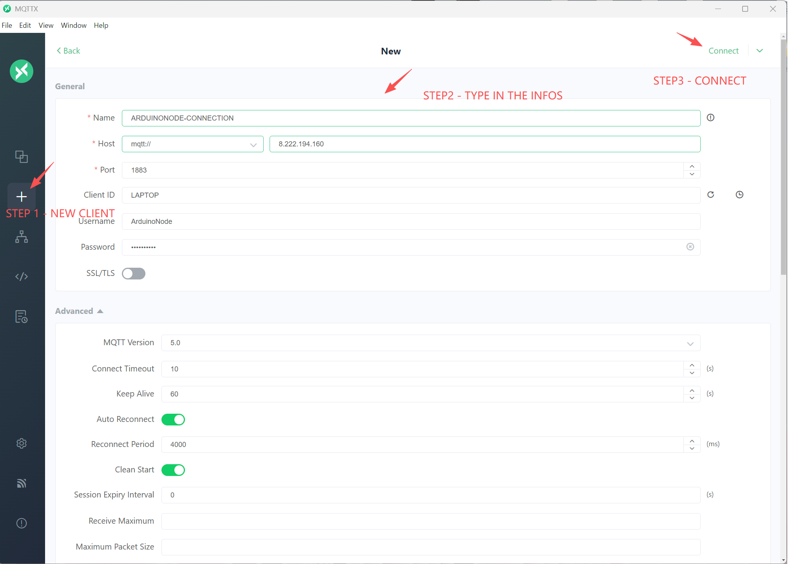
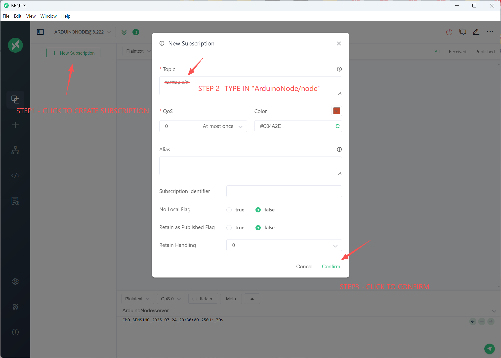
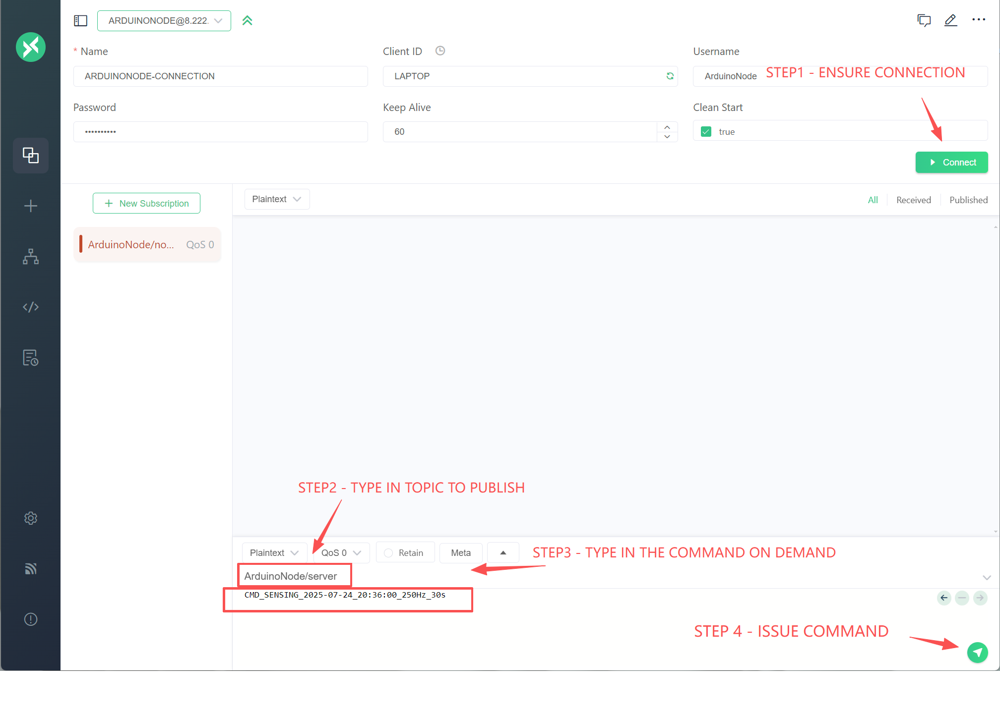

# 传感器使用说明

## 1. 准备工作

### 1.1 MQTT命令发送端

#### (1) 电脑端：

建议安装MQTTX进行MQTT命令发布。[下载链接](https://mqttx.app/downloads)

下载安装好后，首先与服务器建立链接，操作如下：

然后订阅主题“ArduinoNode/node”

完成后即可收到各节点发布的消息。

IOS用户推荐使用MyMQTT。

### 1.2 传感器网络

- 建议使用前对电池进行充电。
  
- 确保所有节点接线牢固，SD卡已正确插入。

- 建议先给各子节点上电，然后再给主节点上电。

## 2. 部署传感器网络

将传感器节点部署在需要监测的区域，最好保证子节点距离主节点不超过25m。

## 3. 下达采集命令

- 首先确保与服务器的连接是启用状态。

- 输入要发布命令的话题“ArduinoNode/server”

- 输入命令内容，请根据采样需要和命令说明进行输入。

## 附录 - ArduinoNode 命令集合

### A. 命令规则

- 所有命令均为字符串，通过 **MQTT** 或 **RF** 通道发送。  
- 时间相关命令需保证调度时间晚于当前时间，并预留至少 **60 秒**用于时间同步（否则会被拒绝）。  
- 采样频率、时长等参数需为整数，单位分别为 **Hz** 和 **秒**。  
- 文件检索命令需指定文件名（不含扩展名）。  

### B. 命令列表与示例

#### 基本命令
| 命令                  | 功能说明                     | 示例 |
|-----------------------|------------------------------|------|
| `CMD_REBOOT`          | 重启网关和所有叶节点         | `CMD_REBOOT` |
| `CMD_GATEWAY_REBOOT`  | 只重启网关                   | `CMD_GATEWAY_REBOOT` |
| `CMD_LEAFNODE_REBOOT` | 只重启叶节点                 | `CMD_LEAFNODE_REBOOT` |
| `CMD_RF_SYNC`         | RF 时间同步                  | `CMD_RF_SYNC` |
| `CMD_NTP`             | NTP 时间同步                 | `CMD_NTP` |
| `CMD_SN`              | 使用默认参数调度采样         | `CMD_SN` |

#### 定时 / 定点采样命令

- **定时传感调度**（延迟秒数、采样频率、采样时长）  
  格式：`CMD_SFN_延迟_频率Hz_时长s`  
  示例：CMD_SFN_120_10Hz_60s  

- **指定时间传感调度**（指定时间、采样频率、采样时长）  
格式：`CMD_SENSING_年-月-日_时:分:秒_频率Hz_时长s`  
示例：CMD_SENSING_2025-09-11_14:30:00_10Hz_60s

#### 数据取回命令

- **数据取回（文件名不含扩展名）**  
格式：`CMD_RETRIEVAL_文件名`  
示例：CMD_RETRIEVAL_20250911_143000

### C. 错误与反馈
- 命令格式错误、时间不合法、参数不合理会收到错误反馈。  
- 同时设备会通过 **LED 红灯提示** 用户错误状态。  

### D. 扩展说明
如需扩展命令或详细参数说明，请参考源码或联系开发者。

!!! warning
    请确保命令格式正确，参数合理，否则命令将被拒绝执行。例如，采样频率上限为250Hz, 推荐值为100Hz，足够应对大多数土木振动监测需求。

!!! warning
    数据取回功能目前不完善，建议直接从各节点的SD卡中获取数据。

!!! tip
    最常用的命令是`CMD_SN`，它会使用默认参数进行采样，而默认参数在代码中可以修改，目前默认采样频率为200Hz，采样时长为300秒。其次常用的命令是定时采样命令`CMD_SFN_延迟_频率Hz_时长s`，例如`CMD_SFN_120_100Hz_300s`表示在120秒后开始采样，采样频率为100Hz，采样时长为300秒。

## 附录 - LED状态与颜色对应关系

| 状态                | 颜色      | 说明         |
|---------------------|-----------|--------------|
| BOOT                | 白色      | 启动/自检    |
| IDLE                | 绿色      | 空闲/待机    |
| PREPARING           | 黄色      | 采样准备     |
| SAMPLING            | 紫色      | 正在采样     |
| RF_COMMUNICATING    | 青色      | RF通信       |
| WIFI_COMMUNICATING  | 蓝色      | WiFi通信     |
| ERROR               | 红色      | 错误/告警    |
| 其它/未知           | 无色      | 未定义/关闭  |