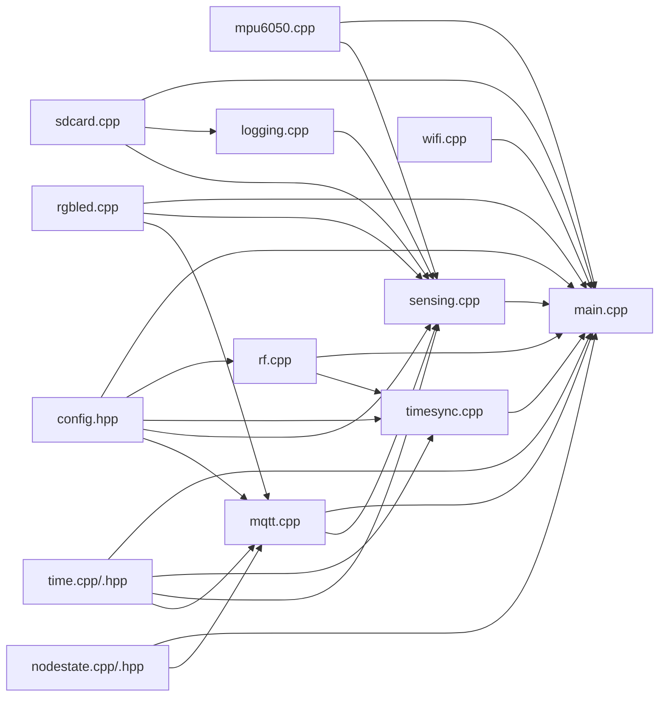

# 架构

本项目中源代码模块之间的依赖关系如下：

```mermaid
graph LR

%% 模块定义
config["config.hpp"]
nodestate["nodestate.cpp/.hpp"]
time["time.cpp/.hpp"]
mpu["mpu6050.cpp"]
sd["sdcard.cpp"]
rgb["rgbled.cpp"]
log["logging.cpp"]
mqtt["mqtt.cpp"]
sensing["sensing.cpp"]
sync["timesync.cpp"]
wifi["wifi.cpp"]
rf["rf.cpp"]
main["main.cpp"]

%% 汇聚方向：模块 → main.cpp（箭头从左往右）
config --> mqtt
config --> sensing
config --> sync
config --> rf
config --> main

nodestate --> mqtt
nodestate --> main

time --> mqtt
time --> sensing
time --> sync
time --> main

mpu --> sensing
mpu --> main

sd --> sensing
sd --> log
sd --> main

rgb --> mqtt
rgb --> sensing
rgb --> main

log --> sensing

mqtt --> sensing
mqtt --> main

sensing --> main

sync --> main

wifi --> main

rf --> sync
rf --> main


```