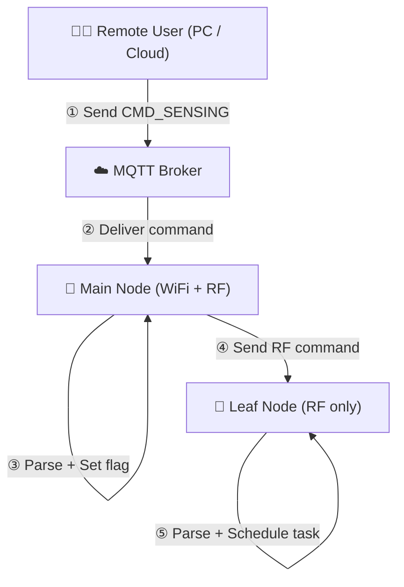

# COMMAND

Controlling nodes is a crucial part of sensor node development. In traditional wireless sensor networks, this is often done by controlling the gateway node, which then communicates with other nodes wirelessly. For IoT nodes, we can leverage the internet for remote control. In this project, we achieve node control over the internet based on the MQTT callback mechanism. Let's first look at the code:




## MQTT Part

As shown in the code, the MQTT callback function processes received commands by matching predefined fields and parsing them to extract relevant variables. It also sets flags or changes the state based on the command content.

```cpp
// Callback when subscribed message is received
void mqtt_callback(char *topic, byte *payload, unsigned int length)
{
  Serial.print("[COMMUNICATION] <MQTT> Message received [");
  Serial.print(topic);
  Serial.print("]: ");

  char message[length + 1];
  for (unsigned int i = 0; i < length; ++i)
  {
    message[i] = (char)payload[i];
    Serial.print(message[i]);
  }
  message[length] = '\0';
  Serial.println();

  // Clean trailing \r or \n
  while (length > 0 && (message[length - 1] == '\r' || message[length - 1] == '\n'))
  {
    message[--length] = '\0';
  }

  String msg_str(message);

  if (msg_str == "CMD_NTP")
  {
    node_status.node_flags.gateway_ntp_required = true;
    node_status.node_flags.leafnode_ntp_required = true;
    Serial.println("[COMMUNICATION] <CMD> CMD_NTP received.");

    // switch to COMMUNICATING state
    node_status.set_state(NodeState::WIFI_COMMUNICATING);
    rgbled_set_by_state(NodeState::WIFI_COMMUNICATING); // Set LED to blue during NTP sync
  }
  else if (msg_str == "CMD_GATEWAY_NTP")
  {
    node_status.node_flags.gateway_ntp_required = true;
    Serial.println("[COMMUNICATION] <CMD> CMD_GATEWAY_NTP received.");

    // switch to COMMUNICATING state
    node_status.set_state(NodeState::WIFI_COMMUNICATING);
    rgbled_set_all(CRGB::Blue); // Set LED to blue during NTP sync
  }
  else if (msg_str == "CMD_LEAFNODE_NTP")
  {
    node_status.node_flags.leafnode_ntp_required = true;
    Serial.println("[COMMUNICATION] <CMD> CMD_LEAFNODE_NTP received.");

    // switch to COMMUNICATING state
    node_status.set_state(NodeState::WIFI_COMMUNICATING);
    rgbled_set_all(CRGB::Blue); // Set LED to blue during NTP sync
  }
  else if (msg_str == "CMD_RF_SYNC")
  {
    node_status.node_flags.time_rf_required = true;
    Serial.println("[COMMUNICATION] <CMD> CMD_RF_SYNC received.");
  }
  else if (msg_str.startsWith("CMD_SENSING_"))
  {
    strncpy(cmd_sensing_raw, message, sizeof(cmd_sensing_raw) - 1);
    cmd_sensing_raw[sizeof(cmd_sensing_raw) - 1] = '\0';
    node_status.node_flags.sensing_requested = true;
    Serial.println("[COMMUNICATION] <CMD> CMD_SENSING received.");

    int y, mo, d, h, mi, s;
    int rate, dur;
    int matched = sscanf(message,
                         "CMD_SENSING_%d-%d-%d_%d:%d:%d_%dHz_%ds",
                         &y, &mo, &d, &h, &mi, &s, &rate, &dur);
    int ms_value = 0;
    if (matched == 8)
    {
      parsed_start_time.year = (uint16_t)y;
      parsed_start_time.month = (uint8_t)mo;
      parsed_start_time.day = (uint8_t)d;
      parsed_start_time.hour = (uint8_t)h;
      parsed_start_time.minute = (uint8_t)mi;
      parsed_start_time.second = (uint8_t)s;
      parsed_start_time.ms = ms_value;

      parsed_freq = (uint16_t)rate;
      parsed_duration = (uint16_t)dur;

      uint64_t now_unix_ms = Time.estimate_time_ms();
      if (now_unix_ms < parsed_start_time.compute_ms_from_calendar())
      {
        Serial.println("[MQTT] Sensing start time is in the future, scheduling sensing.");
        sensing_scheduled_start_ms = parsed_start_time.compute_ms_from_calendar();
        SensingSchedule.unix_ms = sensing_scheduled_start_ms;
        SensingSchedule.unix_epoch = sensing_scheduled_start_ms / 1000;
        SensingSchedule.set_calendar();                                                   // Update calendar fields based on scheduled start time
        sensing_scheduled_end_ms = sensing_scheduled_start_ms + (parsed_duration * 1000); // ms

        sensing_rate_hz = parsed_freq;
        sensing_duration_s = parsed_duration;

        node_status.node_flags.sensing_scheduled = true;

        char buf[128];
        snprintf(buf, sizeof(buf), "[MQTT] Sensing scheduled, sampling at %d Hz for %d seconds, starting at %04d-%02d-%02d %02d:%02d:%02d",
                 parsed_freq, parsed_duration,
                 parsed_start_time.year, parsed_start_time.month, parsed_start_time.day,
                 parsed_start_time.hour, parsed_start_time.minute, parsed_start_time.second);
        Serial.println(buf);
      }
      else
      {
        Serial.println("[MQTT] Sensing start time is in the past, ignoring command.");
        node_status.node_flags.sensing_requested = false;

        // feedback to the mqtt broker
        mqtt_client.publish(MQTT_TOPIC_PUB, "Sensing command ignored: start time is in the past!");

        rgbled_set_all(CRGB::Red); // Set LED to red to indicate error
        delay(3000); // Wait for 2 seconds to indicate error
        if (node_status.get_state() == NodeState::IDLE)
        {
          rgbled_set_by_state(NodeState::IDLE); // Reset LED to IDLE state
        }
      }
    }
    else
    {
      Serial.println("[MQTT] Failed to parse CMD_SENSING command.");
      node_status.node_flags.sensing_requested = false;
    }
  }
  else if (msg_str.startsWith("CMD_RETRIEVAL_"))
  {
    const char *filename_part = message + 14;
    snprintf(retrieval_filename, sizeof(retrieval_filename), "/%s.txt", filename_part);
    node_status.node_flags.data_retrieval_requested = true;
    node_status.node_flags.data_retrieval_sent = false; // Reset sent flag for new retrieval

    Serial.print("[COMMUNICATION] <CMD> CMD_RETRIEVAL received: ");
    Serial.println(retrieval_filename);

    // switch to COMMUNICATING state
    node_status.set_state(NodeState::WIFI_COMMUNICATING);
    rgbled_set_all(CRGB::Blue); // Set LED to blue during data retrieval
  }
  else if (msg_str == "CMD_REBOOT")
  {
    node_status.node_flags.reboot_required_gateway = true;
    node_status.node_flags.reboot_required_leafnode = true;
    Serial.println("[COMMUNICATION] <CMD> CMD_REBOOT received.");
  }
  else if (msg_str == "CMD_GATEWAY_REBOOT")
  {
    node_status.node_flags.reboot_required_gateway = true;
    Serial.println("[COMMUNICATION] <CMD> CMD_GATEWAY_REBOOT received.");
  }
  else if (msg_str == "CMD_LEAFNODE_REBOOT")
  {
    node_status.node_flags.reboot_required_leafnode = true;
    Serial.println("[COMMUNICATION] <CMD> CMD_LEAFNODE_REBOOT received.");
  }
  else
  {
    Serial.println("[COMMUNICATION] <CMD> Unknown command.");
  }
}

```

As shown in the code, we currently define several command types:

1. Reboot
2. NTP synchronization
3. RF synchronization
4. Sensing command
5. Data retrieval command

## RF Part

We use `rf_cmd.hpp` and `rf_cmd.cpp` to handle RF commands. Similar to the MQTT part, we define a set of commands that can be sent to the leaf nodes. The leaf nodes will parse these commands and execute the corresponding actions.

```cpp

#pragma once
#include <Arduino.h>
#include "config.hpp"
#include "nodestate.hpp"
#include "rf.hpp"
#include "rgbled.hpp"
#include "wifi.hpp"
#include "mqtt.hpp"

#define RF_CMD_RETRY        3     
#define RF_CMD_WAIT_MS      100   

// For GATEWAY
void rf_command(const char *cmd);
void send_command_with_retry(const char *cmd);

// For LEAFNODE
void rf_handle();


```


```cpp
#include "rf_cmd.hpp"

void rf_command(const char *cmd)
{
    RFMessage msg;
    msg.from_id = NODE_ID;
    strncpy(msg.payload, cmd, sizeof(msg.payload));

    for (uint8_t target_id = 1; target_id <= NUM_NODES; ++target_id)
    {
        msg.to_id = target_id;

        Serial.print("[GATEWAY] Sending RF Command to Node ");
        Serial.print(target_id);
        Serial.print(": ");
        Serial.println(msg.payload);

        rf_stop_listening();
        bool success = rf_send(msg.to_id, msg);
        if (success)
        {
            Serial.println("[GATEWAY] Command sent successfully.");
        }
        else
        {
            Serial.println("[GATEWAY] Failed to send command.");
        }
        rf_start_listening();
    }
}

void send_command_with_retry(const char *cmd)
{
    for (int attempt = 0; attempt < RF_CMD_RETRY; ++attempt)
    {
        rf_command(cmd);  
        delay(RF_CMD_WAIT_MS); 
    }
}

void rf_handle()
{
    RFMessage msg;

    if (rf_receive(msg, 200)) // 200ms timeout
    {
        if (msg.to_id != NODE_ID)
            return;

        Serial.print("[RF_COMMUNICATION] Message received from Node ");
        Serial.print(msg.from_id);
        Serial.print(": ");
        Serial.println(msg.payload);

        // === CMD_REBOOT ===
        if (strcmp(msg.payload, "CMD_REBOOT") == 0)
        {
            Serial.println("[LEAFNODE] Reboot command received.");
            node_status.node_flags.reboot_required_leafnode = true;
            node_status.set_state(NodeState::BOOT);
            rgbled_set_by_state(NodeState::BOOT);
        }

        // === CMD_RF_SYNC ===
        else if (strcmp(msg.payload, "CMD_RF_SYNC") == 0)
        {
            Serial.println("[LEAFNODE] RF Sync command received.");
            node_status.node_flags.time_rf_required = true;
            node_status.set_state(NodeState::RF_COMMUNICATING);
            rgbled_set_by_state(NodeState::RF_COMMUNICATING);
        }

        // === Sensing Schedule Command ===
        else if (strncmp(msg.payload, "S_", 2) == 0)
        {
            Serial.println("[LEAFNODE] Sensing command received.");

            // Step 1: Extract 12-digit time
            char datetime[13] = {0};
            strncpy(datetime, msg.payload + 2, 12);

            // Step 2: Find first and second underscore after time part
            const char *ptr = msg.payload + 14;
            const char *first_underscore = strchr(ptr, '_');
            if (!first_underscore)
            {
                Serial.println("[LEAFNODE] Invalid sensing command format: missing first underscore.");
                return;
            }

            const char *second_underscore = strchr(first_underscore + 1, '_');
            if (!second_underscore)
            {
                Serial.println("[LEAFNODE] Invalid sensing command format: missing second underscore.");
                return;
            }

            // Step 3: Extract substrings for rate and duration
            char rate_buf[6] = {0};
            char dur_buf[6] = {0};

            size_t rate_len = second_underscore - (first_underscore + 1);
            size_t dur_len = strlen(second_underscore + 1);

            if (rate_len >= sizeof(rate_buf) || dur_len >= sizeof(dur_buf))
            {
                Serial.println("[LEAFNODE] Rate or duration value too long.");
                return;
            }

            strncpy(rate_buf, first_underscore + 1, rate_len);
            strncpy(dur_buf, second_underscore + 1, dur_len);

            int rate = atoi(rate_buf);
            int dur = atoi(dur_buf);

            // Step 4: Set SensingSchedule
            if (SensingSchedule.set_from_string_YYMMDDHHMMSS(datetime))
            {
                parsed_freq = rate;
                sensing_rate_hz = parsed_freq;
                parsed_duration = dur;
                sensing_duration_s = parsed_duration;

                sensing_scheduled_start_ms = SensingSchedule.compute_ms_from_calendar();
                sensing_scheduled_end_ms = sensing_scheduled_start_ms + dur * 1000;

                node_status.node_flags.sensing_scheduled = true; // very important!

                // Debug print
                Serial.print("[LEAFNODE] Parsed Time: ");
                Serial.print(SensingSchedule.year);
                Serial.print("-");
                Serial.print(SensingSchedule.month);
                Serial.print("-");
                Serial.print(SensingSchedule.day);
                Serial.print(" ");
                Serial.print(SensingSchedule.hour);
                Serial.print(":");
                Serial.print(SensingSchedule.minute);
                Serial.print(":");
                Serial.println(SensingSchedule.second);

                Serial.print("[LEAFNODE] Parsed Rate = ");
                Serial.print(parsed_freq);
                Serial.print(" Hz, Duration = ");
                Serial.print(parsed_duration);
                Serial.println(" sec");

                Serial.print("[LEAFNODE] Scheduled Start Time (ms): ");
                Serial.println(sensing_scheduled_start_ms);

                Serial.print("[LEAFNODE] Scheduled Sampling Rate: ");
                Serial.print(sensing_rate_hz);

                Serial.print(" Hz, Duration: ");
                Serial.print(sensing_duration_s);
                Serial.println(" sec");
            }
            else
            {
                Serial.println("[LEAFNODE] Failed to parse sensing schedule time.");
            }
        }

        // === Unknown Command ===
        else
        {
            Serial.println("[RF_COMMUNICATION] Unknown command.");
        }
    }
}


```


