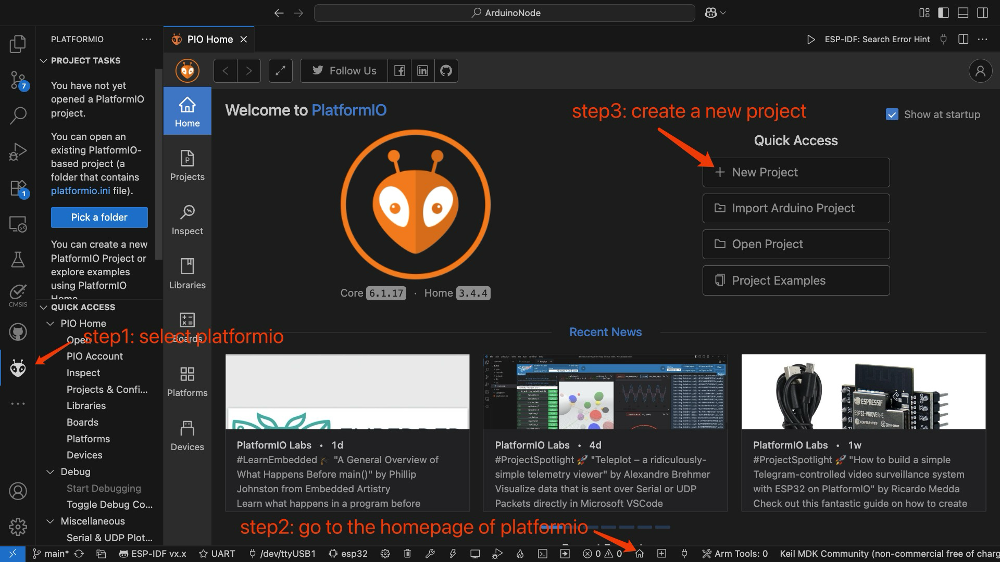
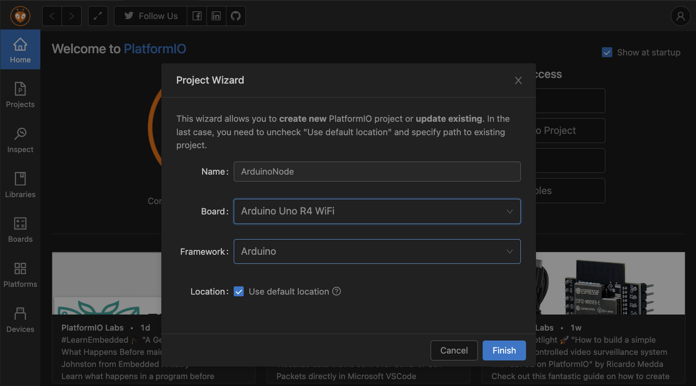
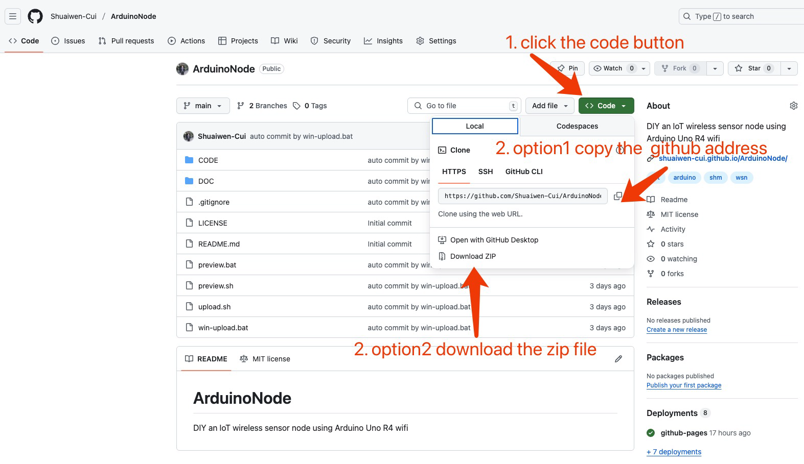

# PROGRAMMING

## Create a New Project





Generally, if you don't have a project yet, you can create one by following the steps shown in the images:

1. Click the PlatformIO icon on the left to bring up the PlatformIO panel at the bottom.

2. Click the home icon in the PlatformIO panel to go to the PlatformIO home page.

3. Click the "New Project" button, enter the project name, and select the development board and framework.

## Import a Project

If you already have a project, you can open the project folder in the PlatformIO environment. First, we need to obtain the code for this project, which can be done in two ways:

1. Clone the project code to your local machine using Git. Open a terminal and enter the following command:

```bash
git clone https://github.com/Shuaiwen-Cui/ArduinoNode.git
```

1. Download the project code as a compressed file from GitHub, then unzip it and open the folder.



## Programming in the IDE


After opening the project in PlatformIO, the left side shows the file explorer. The `lib` folder is particularly important as it contains the libraries used in this project, and the `src` folder contains the source code. At the bottom of the page are quick access buttons, with three key functions: Compile, Upload, and Serial Monitor.

## Arduino Programming

```cpp
#include <Arduino.h> // unlike Arduino IDE, PlatformIO requires this header file
void setup() 
{
  // Initialize the serial communication at 9600 baud
  Serial.begin(9600);
}
void loop() 
{
  // Print "Hello, World!" to the Serial Monitor
  Serial.println("Hello, World!");
  
  // Wait for 1 second (1000 milliseconds)
  delay(1000);
}
```
In the code above, the basic framework for microcontroller programming consists of "initialization" and "infinite loop," which differs from computer programming that requires an exit mechanism. In the Arduino development framework, the `setup()` function is used for initialization, while the `loop()` function contains code that runs in an infinite loop. After uploading the code, the microcontroller automatically runs the `setup()` function once and then enters the `loop()` function.

```cpp
void setup() 
{
    // Initialization
}

void loop() 
{
    // Infinite loop
}
```