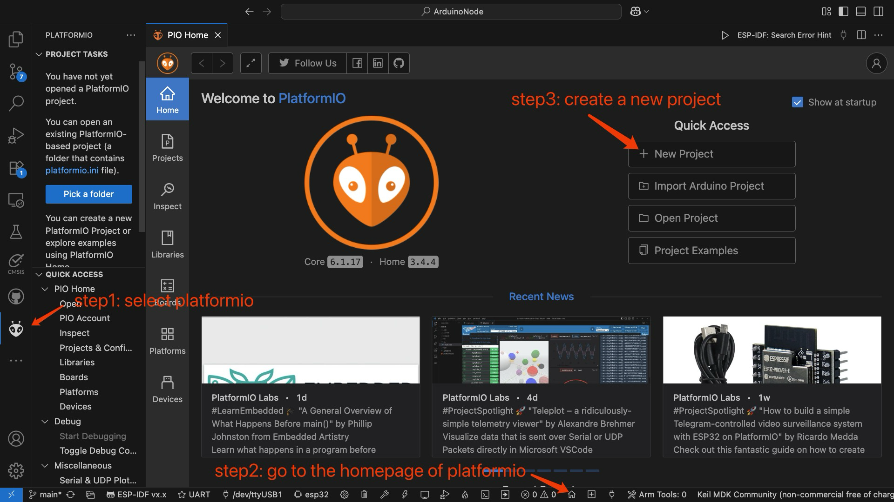
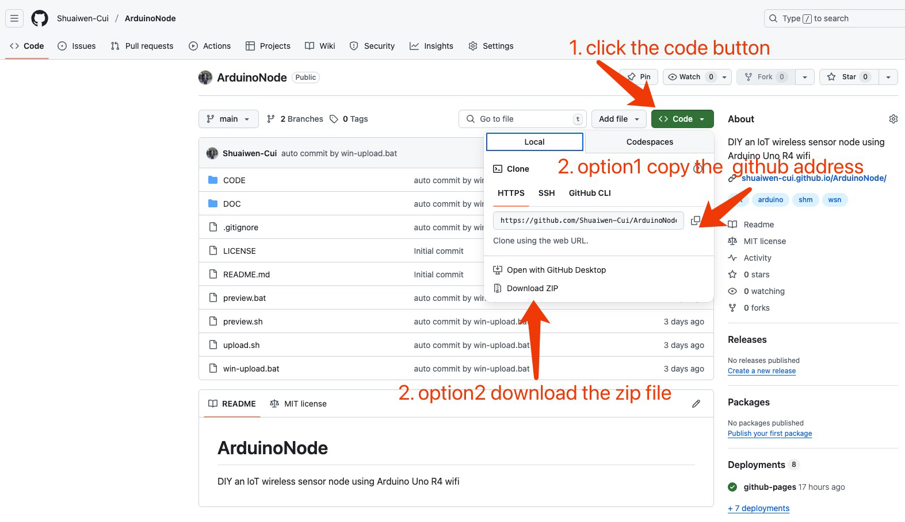

# 编程

## 创建项目

!!! tip
    本项目其实不需要创建项目，这一部分只是为了让读者了解如何使用PlatformIO创建项目。




一般来说，如果还没有项目，可以通过按照图示的步骤来创建一个项目：

1. 点击左侧的platformio图标唤出底部的platformio图标。

2. 点击底部的platformio的主页图标，进入platformio主页。

3. 点击新建项目按钮，输入项目名称和选择开发版和开发框架。

## 导入项目

如果已经有项目，只需要在platformio环境下打开项目文件夹即可。首先我们获取本项目文件代码, 有两种方式：

1. 使用git克隆本项目代码到本地。打开终端，输入以下命令：

```bash
git clone https://github.com/Shuaiwen-Cui/ArduinoNode.git
```

2. 直接下载本项目的代码压缩包，解压后打开。




## 在IDE中编程


如图所示，在PlatformIO中打开项目后，左侧是文件浏览器，比较重要的是`lib`文件夹，里面存放了本项目的库文件, 还有`src`文件夹，里面存放了本项目的源代码。在页面底部是快捷按钮，比较重要的有三个，编译，上传和串口监视器。

## Arduino编程

```cpp
#include <Arduino.h> // unlike Arduino IDE, PlatformIO requires this header file

void setup() 
{
  // Initialize the serial communication at 9600 baud
  Serial.begin(9600);
}

void loop() 
{
  // Print "Hello, World!" to the Serial Monitor
  Serial.println("Hello, World!");
  
  // Wait for 1 second (1000 milliseconds)
  delay(1000);
}
```

如上面代码所示，单片机编程的基本框架是“初始化”加上“无限循环”，这一点与电脑编程要求必须有退出机制不同。在Arduino开发框架下，`setup()`函数用于初始化，而`loop()`函数则是无限循环执行的代码。每次上传代码后，单片机会自动运行`setup()`函数一次，然后进入`loop()`函数。

```cpp
void setup() 
{
    // Initialization
}

void loop() 
{
    // Infinite loop
}
```