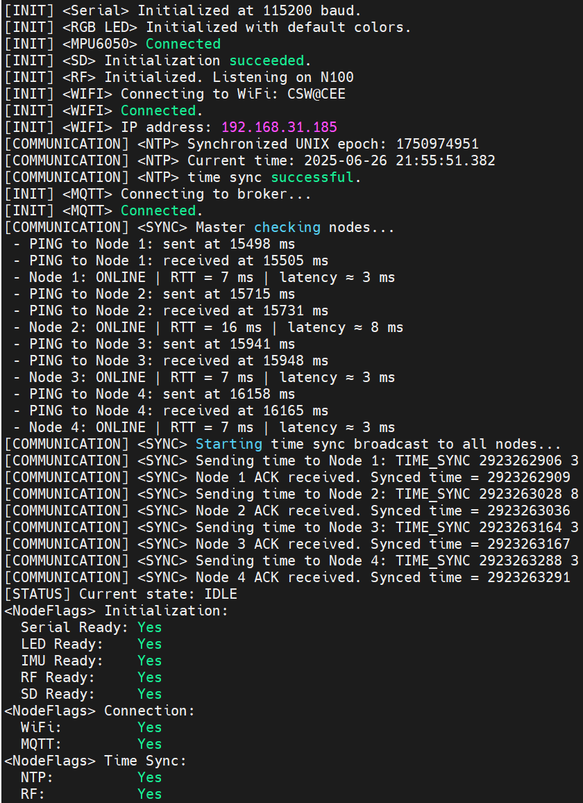

# 时间同步

时间同步对于无线网络设备至关重要。它确保设备之间的时间一致性，从而使得数据包的时间戳、日志记录和其他时间相关的功能能够正确工作。在本项目中时间同步我们分两个部分来展开，第一部分是与互联网的时间同步，第二部分是设备之间的时间同步。

在讨论开始之前，我们先来看一下代码。

**time.hpp**

```cpp
#pragma once
#include <Arduino.h>
#include "config.hpp"
#include "nodestate.hpp"

/*
 * Time synchronization header
 * 
 * Provides:
 * - NTP synchronization function
 * - RF-based online check and RTT estimation
 * - Stores RF latency (RTT/2) and online status for each node
 */

/* === RF Time Synchronization Configuration === */
#define RF_PING_PAYLOAD "PING"
#define RF_PONG_PAYLOAD "PONG"
#define RF_TIME_SYNC_HEADER "TSYNC"
#define RF_TIME_ACK_HEADER "TACK"
#define RF_RESPONSE_WAIT_MS      300   // 300 ms wait per reply
#define RF_RETRY_PER_CYCLE         5   // Retry 5 times per send

extern int32_t node_rf_latency[NUM_NODES + 1];
extern bool node_online[NUM_NODES + 1];

bool sync_time_ntp();
bool sync_check_rf_online();
bool rf_time_sync();
```

**time.cpp**

```cpp
#include "timesync.hpp"
#include "config.hpp"
#include "time.hpp"
#include "rf.hpp"
#include <WiFiUdp.h>
#include <NTPClient.h>

WiFiUDP ntpUDP;
// NTPClient timeClient(ntpUDP, "pool.ntp.org", 28800, 60000);
NTPClient timeClient(ntpUDP, "asia.pool.ntp.org", 28800, 60000);

int32_t node_rf_latency[NUM_NODES + 1] = {0};
bool node_online[NUM_NODES + 1] = {false};

bool sync_time_ntp()
{
    timeClient.begin();
    const uint64_t MIN_VALID_EPOCH = 1735689600; // 2025-01-01 00:00:00 UTC
    bool success = false;

    for (int attempt = 1; attempt <= 5; ++attempt)
    {
        if (!timeClient.update())
        {
            Serial.print("[COMMUNICATION] <NTP> Attempt ");
            Serial.print(attempt);
            Serial.println(": Failed to get NTP time.");
            delay(1000);
            continue;
        }

        uint64_t epoch = timeClient.getEpochTime();
        if (epoch < MIN_VALID_EPOCH)
        {
            Serial.print("[COMMUNICATION] <NTP> Attempt ");
            Serial.print(attempt);
            Serial.print(": Invalid epoch = ");
            Serial.println(epoch);
            delay(1000);
            continue;
        }

        // === Valid time received, set local time ===
        uint16_t current_millis = millis();

        Time.set_time_epoch(epoch);
        Time.last_update_epoch = epoch;
        Time.last_update_ms = current_millis % 1000 + (epoch * 1000); // Convert to ms, keeping current millis
        Time.mcu_base_ms = current_millis;
        Time.mcu_time_ms = current_millis;
        Time.delta_ms = 0;
        Serial.print("[COMMUNICATION] <NTP> Calendar time set to: ");
        Time.print(); // Print the time to Serial for debugging

        Serial.print("[COMMUNICATION] <NTP> Synchronized UNIX epoch: ");
        Serial.println(epoch);
        Serial.print("[COMMUNICATION] <NTP> Current time: ");
        Time.print();

        success = true;
        break;
    }

    if (!success)
    {
        Serial.println("[COMMUNICATION] <NTP> Final NTP sync failed after 5 attempts.");
    }

    return success;
}

bool sync_check_rf_online()
{
#ifdef GATEWAY
    Serial.println("[COMMUNICATION] <SYNC> Master checking nodes...");

    for (uint8_t id = 1; id <= NUM_NODES; ++id)
    {
        bool success = false;
        uint32_t rtt = 0;

        for (uint8_t attempt = 0; attempt < 3; ++attempt)
        {
            // Construct PING message
            RFMessage msg;
            msg.from_id = NODE_ID;
            msg.to_id = id;
            strncpy(msg.payload, RF_PING_PAYLOAD, sizeof(msg.payload) - 1);
            msg.payload[sizeof(msg.payload) - 1] = '\0';

            // Stop listening before sending
            rf_stop_listening();
            bool sent = rf_send(id, msg, false); // No ACK requested
            rf_start_listening();

            // If send failed, retry
            if (!sent)
            {
                Serial.print(" - Node ");
                Serial.print(id);
                Serial.println(": SEND FAILED");
                delay(100);
                continue;
            }

            // Record send timestamp immediately after successful transmission
            uint32_t t_send = millis();
            Serial.print(" - PING to Node ");
            Serial.print(id);
            Serial.print(": sent at ");
            Serial.print(t_send);
            Serial.println(" ms");

            // Attempt to receive response within timeout
            RFMessage response;
            bool received = rf_receive(response, RF_RESPONSE_WAIT_MS);

            // Record receive timestamp after receive attempt
            uint32_t t_recv = millis();
            Serial.print(" - PING to Node ");
            Serial.print(id);
            Serial.print(": received at ");
            Serial.print(t_recv);
            Serial.println(" ms");

            // Validate response: correct sender, receiver, and payload prefix
            if (received &&
                response.from_id == id &&
                response.to_id == NODE_ID &&
                strncmp(response.payload, RF_PONG_PAYLOAD, 4) == 0)
            {
                rtt = t_recv - t_send;
                success = true;
                break;
            }

            delay(100); // Cooldown between attempts
        }

        if (success)
        {
            node_online[id] = true;
            node_rf_latency[id] = rtt / 2;

            Serial.print(" - Node ");
            Serial.print(id);
            Serial.print(": ONLINE | RTT = ");
            Serial.print(rtt);
            Serial.print(" ms | latency ≈ ");
            Serial.print(node_rf_latency[id]);
            Serial.println(" ms");
        }
        else
        {
            node_online[id] = false;

            Serial.print(" - Node ");
            Serial.print(id);
            Serial.println(": OFFLINE");
        }

        delay(200); // Prevent RF congestion
    }

    // Determine if any node was successfully contacted
    bool any_online = false;
    for (uint8_t id = 1; id <= NUM_NODES; ++id)
    {
        if (node_online[id])
        {
            any_online = true;
            break;
        }
    }

    // Compute the average latency across online nodes, and assign it to the offline nodes
    int32_t total_latency = 0;
    int32_t online_count = 0;
    float average_latency = 0.0f;
    for (uint8_t id = 1; id <= NUM_NODES; ++id)
    {
        if (node_online[id])
        {
            total_latency += node_rf_latency[id];
            online_count++;
        }
    }

    if (online_count > 0)
    {
        average_latency = static_cast<float>(total_latency) / online_count;
    }
    else
    {
        average_latency = 0.0f; // No nodes online, set to 0
    }

    // Assign average latency to offline nodes
    for (uint8_t id = 1; id <= NUM_NODES; ++id)
    {
        if (!node_online[id])
        {
            node_rf_latency[id] = static_cast<int32_t>(average_latency);
        }
    }

    // Update status flag
    return any_online;

#else // LEAF NODE
    Serial.println("[COMMUNICATION] <SYNC> Leaf waiting for PING...");

    while (true)
    {
        RFMessage msg;
        bool received = rf_receive(msg, 500);

        if (!received)
            continue;

        // Ensure message is intended for this node and is a valid PING
        if (msg.to_id != NODE_ID || strncmp(msg.payload, RF_PING_PAYLOAD, 4) != 0)
            continue;

        Serial.print("[COMMUNICATION] <SYNC> Received PING from Node ");
        Serial.println(msg.from_id);

        // Construct and send PONG response
        RFMessage response;
        response.from_id = NODE_ID;
        response.to_id = msg.from_id;
        strncpy(response.payload, RF_PONG_PAYLOAD, sizeof(response.payload) - 1);
        response.payload[sizeof(response.payload) - 1] = '\0';

        rf_stop_listening();
        rf_send(msg.from_id, response, false); // No ACK
        rf_start_listening();

        Serial.println("[COMMUNICATION] <SYNC> PONG sent. Leaf sync complete.");
        break;
    }

    return true;
#endif
}

bool rf_time_sync()
{
#ifdef GATEWAY
    Serial.println("[COMMUNICATION] <SYNC> Starting time sync broadcast to all nodes...");

    for (uint8_t id = 1; id <= NUM_NODES; ++id)
    {

        RFMessage msg;
        msg.from_id = NODE_ID;
        msg.to_id = id;
        uint64_t adjusted_time = Time.estimate_time_ms() + node_rf_latency[id];
        uint32_t high = adjusted_time >> 32;
        uint32_t low = adjusted_time & 0xFFFFFFFF;
        snprintf(msg.payload, sizeof(msg.payload), "%s %lu %lu", RF_TIME_SYNC_HEADER, high, low);

        Serial.print("[COMMUNICATION] <SYNC> Sending time to Node ");
        Serial.print(id);
        Serial.print(": ");
        Serial.println(msg.payload);

        rf_stop_listening();
        bool sent = rf_send(id, msg, false);
        rf_start_listening();

        if (!sent)
        {
            Serial.print("[COMMUNICATION] <SYNC> Failed to send to Node ");
            Serial.println(id);
            continue;
        }

        RFMessage ack;
        bool received = rf_receive(ack, RF_RESPONSE_WAIT_MS);

        if (received &&
            ack.from_id == id &&
            ack.to_id == NODE_ID &&
            strncmp(ack.payload, RF_TIME_ACK_HEADER, strlen(RF_TIME_ACK_HEADER)) == 0)
        {
            Serial.print("[COMMUNICATION] <SYNC> Node ");
            Serial.print(id);
            Serial.println(" ACK received.");
        }
        else
        {
            Serial.print("[COMMUNICATION] <SYNC> No ACK from Node ");
            Serial.println(id);
        }

        delay(100); // avoid RF congestion
    }

    node_status.node_flags.time_rf_synced = true;
    return true;

#else // LEAF NODE
    Serial.println("[COMMUNICATION] <SYNC> Leaf waiting for TIME_SYNC...");

    uint64_t adjusted_time = 0;

    while (true)
    {
        RFMessage msg;
        bool received = rf_receive(msg, 1000);

        if (!received)
            continue;

        if (msg.to_id != NODE_ID || strncmp(msg.payload, RF_TIME_SYNC_HEADER, strlen(RF_TIME_SYNC_HEADER)) != 0)
            continue;

        Serial.print("[SYNC] Received payload: ");
        Serial.println(msg.payload);

        uint32_t high = 0, low = 0;
        int parsed = sscanf(msg.payload + strlen(RF_TIME_SYNC_HEADER) + 1, "%lu %lu", &high, &low);
        if (parsed != 2)
        {
            Serial.println("[SYNC] Failed to parse adjusted_time from payload.");
            continue;
        }
        uint64_t adjusted_time = ((uint64_t)high << 32) | low;

        Time.set_time_ms(adjusted_time);
        Time.last_update_ms = adjusted_time;
        Time.last_update_epoch = adjusted_time / 1000;
        Time.mcu_base_ms = millis();
        node_status.node_flags.time_rf_synced = true;

        Serial.print("[SYNC] Local time updated to ");
        Time.print();

        RFMessage ack;
        ack.from_id = NODE_ID;
        ack.to_id = msg.from_id;
        snprintf(ack.payload, sizeof(ack.payload), "%s", RF_TIME_ACK_HEADER);

        rf_stop_listening();
        rf_send(msg.from_id, ack, false);
        rf_start_listening();

        Serial.println("[COMMUNICATION] <SYNC> Time sync ACK sent.");
        break;
    }

    return true;
#endif
}

```

本项目中的时间同步分为两类：  
1. 与互联网进行时间同步（使用 NTP 协议）  
2. 设备之间进行本地时间同步（基于 RF 通信和 RTT 计算）

## 一、与互联网的时间同步 - Network Time Protocol (NTP)

NTP（网络时间协议）用于同步设备与互联网上标准时间服务器的时间。其基本原理如下：

- 本地设备发送时间请求，并记录本地发送时间 `t1`
- NTP 服务器接收请求，记录接收时间 `t2`
- NTP 服务器返回当前时间 `t3`
- 本地设备接收响应，并记录接收时间 `t4`

通过这些时间戳，本地设备可以估算网络延迟，并计算出精确的服务器时间以调整本地系统时间。

本项目中使用的相关函数是：

### `sync_time_ntp()`

该函数通过 `NTPClient` 库从互联网获取当前的 Unix 时间戳。其核心逻辑包括：

- 初始化 NTP 客户端并连接服务器
- 获取当前 UTC 时间（Unix timestamp）
- 将其转换并更新全局时间变量 `Time`
- 同时记录当前的运行时间（如 `millis()`），用于后续以毫秒精度推算当前时间

这种方式适用于设备刚启动时或需要校准的场景，缺点是依赖网络，并且精度受限（Arduino 平台通常精度只能到秒级）。

---

## 二、本地设备之间的时间同步 - 基于 RTT 和 RF 通信

由于 NTP 在嵌入式平台上精度有限，且依赖网络，因此我们为本地无线传感器节点设计了基于无线电（RF）通信的高精度同步机制。其主要思路如下：

- 由主节点（Gateway）作为时间基准
- 子节点（Leaf）通过 RF 通信接收主节点发送的基准时间
- 同步过程中计算 RTT（Round Trip Time）来估算通信延迟

时间同步分为两个步骤：

---

### 1. 节点在线状态检测与 RTT 计算

主节点向每个子节点发送 `PING` 消息，子节点收到后立即回复 `PONG` 消息。主节点通过记录：

- `t_send`：发送 `PING` 的时间
- `t_recv`：收到 `PONG` 的时间

可计算出往返时间：

\[
RTT = t_{recv} - t_{send}
\]

从而估算一半的单向延迟（RF latency）：

\[
\text{Latency} = RTT / 2
\]

主节点维护两个数组：

- `node_rf_latency[]`：记录每个子节点的通信延迟
- `node_online[]`：记录每个子节点的在线状态（是否有响应）

如果某些子节点未响应，系统会使用在线节点的平均延迟作为替代值填充。

---

### 2. 基于 RTT 和主节点时间的同步

在获取所有节点的通信延迟后，主节点发送 `TIME_SYNC` 消息给各个子节点，消息内容包含：

- 当前主节点时间
- 与该子节点的 RF 延迟

子节点收到后进行如下操作：

1. 拆解消息，提取主节点时间和延迟
2. 将主节点时间加上延迟，得到本地应设定的同步时间
3. 将该同步时间覆盖本地时间
4. 回复一条 `ACK` 消息，带上新同步时间作为确认

这样子节点的时间就与主节点同步了，并可在毫秒精度范围内保持一致性。

---

## 总结

| 同步方式 | 特点 | 优点 | 缺点 |
|----------|------|------|------|
| NTP同步 | 通过网络获取UTC时间 | 无需本地基准设备，通用性强 | 精度有限（秒级），依赖网络 |
| 本地RF同步 | 节点间无线通信+RTT校准 | 精度高（毫秒级），适用于局域无线网 | 需实现通信机制和节点协调 |

为了兼顾精度与实用性，本项目设计中采用先通过 NTP 初始化时间，然后通过 RF 实现子节点的高精度同步。


!!! tip "注意"
    在实际应用中，NTP 同步通常用于设备启动时的初始时间设置，而 RF 同步则用于设备间的持续时间一致性维护。这样可以确保系统在网络不稳定或离线时仍能保持较高的时间精度。

## 串口输出示例

以下是一个典型的串口输出示例，展示了时间同步过程中的关键步骤：

