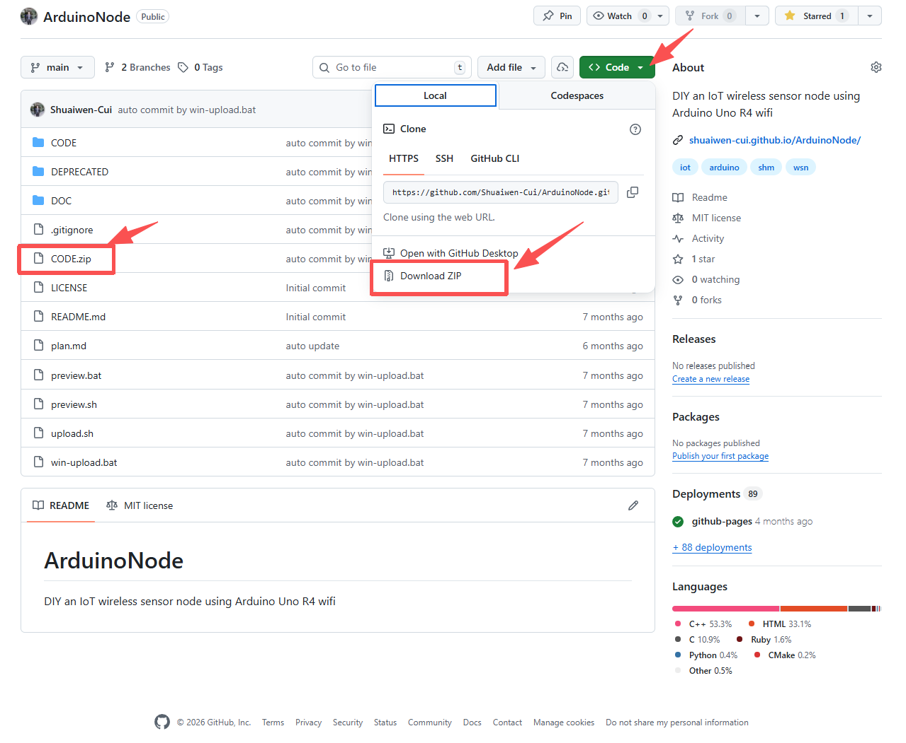

# SOFTWARE

By programming, we can implement various applications based on hardware functions. Under the condition of introducing various hardware libraries, we can encapsulate commonly used functions into functions for the main program to call. These functions can be divided into several groups: sensing, communication, storage, time control, interaction, etc.

Example code can be found in the `CODE` folder/zip in the [GitHub repository](https://github.com/Shuaiwen-Cui/ArduinoNode.git). You can download it the repository or `git clone` it to your local machine.

